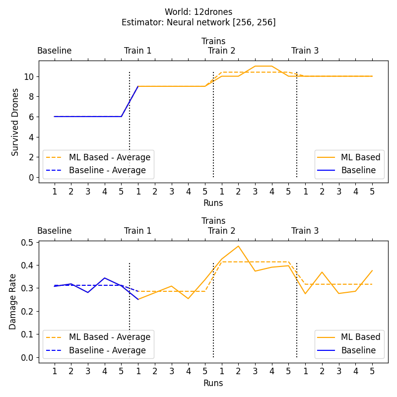
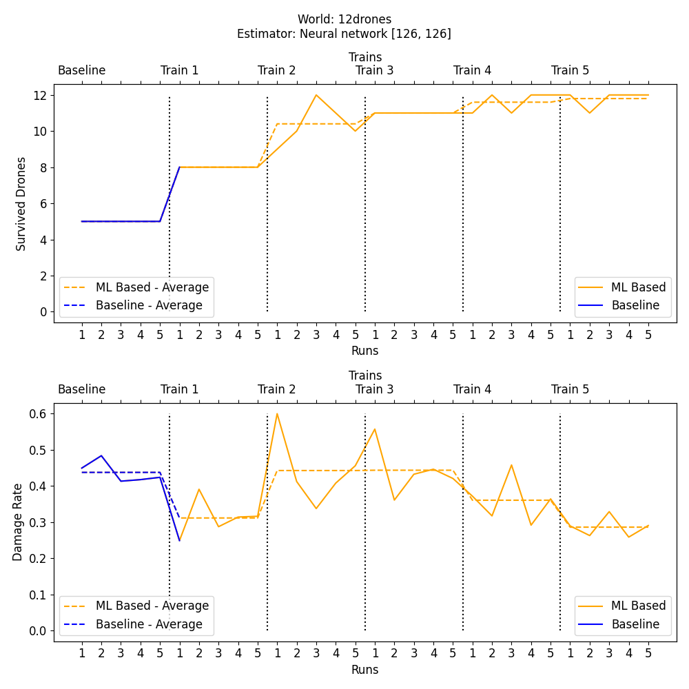

# Drone Charging Example
In this broad example, we provide a simulation that runs a system which protects field of crops against flocks of birds, using virtual drones. In this document, a complete guide to run the example is presented:

- [Installation](#installation)
- [Usage](#usage)
- [YAML Experiments](#yaml-experiments)
- [Simulation Components](#simulation-components)

## Installation
To run the example, some libraries must be installed. The installation requires `Python 3` and `pip`. If you have `pip` installed skip to - [Package Installation](#package-installation).

To install `pip` follow the following instructions:

### Install pip on Debian/Ubuntu 
```
apt install python3-pip            
```
### Install pip on Debian/Ubuntu
```
apt install python3-pip
```
### Install pip on CentOS, RHEL, Fedora
```
yum -y update
yum install python-pip
```
### Install pip on Arch Linux
```
pacman -S python-pip
```
### Install pip on openSUSE
```
zypper install python3-pip
```
### Install pip on Windows
First download https://bootstrap.pypa.io/get-pip.py and copy/save it in a folder. Then run the following command:
```
python <path-to-get-pip.py>/get-pip.py
```
### Package Installation
All the required packages and libraries are stored in [requirements.txt](requirements.txt).
> :warning: the requirements include **Tensorflow**, and the size of its dependencies could reach **1.5 GB**

#### Step 1: install all the packages by running the following command:
```
pip install -r requirements.txt
```
#### Step 2: install ML-DEECo using `pip` (the `--editable` switch can be omitted if one does not plan to change the code of ML-DEECo):
```
pip install --editable ../ml_deeco
```

## Usage
The simulation is configured with a YAML file, a few examples could be found in [experiments](/experiments/). The results will be stored in results folder. For a quick run, simply execute the following command:

```
py run.py experiments/12drones.yaml
```

The above command runs the simulation once and store the results in results folder. To run the simulation multiple times use `-n <NUMBER>`, and to view a chart at the end of run, use `-c`.


```
py run.py experiments/12drones.yaml -n 5 -c
```

Please note that the simulation will not train unless `-t <NUMBER>` is set, and it must be set more than 1. 

To Observe the outcomes during runtime, one can use `-v <NUMBER>` which sets the verboseness between 0-4. 

The following command will run `12drones.yaml` for 4 iterations, where each iteration consists of running the simulation 5 times and then training the estimator. Therefore, it will run and collect the results of total of 20 simulation runs, with verboseness level of 2. The first 5 simulation runs will use no estimation at all.

```
py run.py experiments/12drones.yaml -n 5 -t 4 -v 2 -c
```

The above command will relatively spend more time to finalize and store the results. Should the YAML file not change, the graph will look like the following one:


As the behavior of the system is influenced by the estimates, the data collected in the second iteration will be different from the first iteration. To prevent feedback loops, the `-d ` switch can be used to accumulate training data from all previous iterations (without it, only the data from the current iteration are used for training). Note that this will increase the time needed to train the estimator, because more examples are used for training. 

Additionally, one might try the experiment with different test split (using `--test_split <RATE>`), different hidden layers (using `--hidden_layers [<NUMBER>,<NUMBER>]`) or a random seed (using `-s <NUMBER>`). To specify a subfolder in results to store all the results use `-o <PATH>`; if the folder does not exist it will be created.

```
py run.py experiments/12drones.yaml -n 5 -t 6 -d -o test_12_drones --hidden_layers 126 126 -c --test_split 0.4 --seed 423
```
> The above command will run the simulation 30 times (6 x 5) with training every 5 runs, accumulating all data, saving 6 models in results/test_12_drones/neural_network folder. The model will have two hidden layers with 126 neurons, splitting 40% data for validation and the random seed to initialize random objects is 4232. The below chart shows the results:


It could be observed that with tuning neural network parameters, the outcome varies, and it could be improved. The models are stored in the results/test_12_drones/neural_network as `h5` files. They are portable models that could be used with the same simulation (using `-l <PATH-TO-MODEL>`), but perhaps with different size of flocks of birds (overriding the YAML configuration with `-x <NUMBER>`). Additionally, a visualizer is attached to the simulation, and it can be toggled with `-a`.
> :warning: using *`-a`* with multiple runs will produce GIF animations for all of them, and it might take excessive storage and time.

```
py run.py experiments/12drones.yaml -l results/test_12_drones/neural_network/model_6.h5  -x 20 -a -o vis_12drones
```
The above command will produce animated scenario of the 12drone world. The file is located in vis_12drones/animations.


For further run options, 
<pre>
usage: run.py [-h] [-x BIRDS] [-n NUMBER] [-t TRAIN] [-o OUTPUT] [-v VERBOSE]
              [-a] [-c] [-w {baseline,neural_network}] [-d]
              [--test_split TEST_SPLIT]
              [--hidden_layers HIDDEN_LAYERS [HIDDEN_LAYERS ...]] [-s SEED]
              [-b BASELINE] [-l LOAD] [-e] [--threads THREADS]
              input
         

  -h, --help            show this help message and exit
  -x BIRDS, --birds BIRDS 
                        number of birds, if no set, it loads from yaml file.
  -n NUMBER, --number NUMBER
                        the number of simulation runs per training.
  -t TRAIN, --train TRAIN
                        the number of trainings to be performed.
  -o OUTPUT, --output OUTPUT
                        the output folder
  -v VERBOSE, --verbose VERBOSE
                        the verboseness between 0 and 4.
  -a, --animation       toggles saving the final results as a GIF animation.
  -c, --chart           toggles saving and showing the charts.
  -w {baseline,neural_network}, --waiting_estimation {baseline,neural_network}
                        The estimation model to be used for predicting charger
                        waiting time.
  -d, --accumulate_data
                        False = use only training data from last iteration.
                        True = accumulate training data from all previous
                        iterations.
  --test_split TEST_SPLIT
                        Number of records used for evaluation.
  --hidden_layers HIDDEN_LAYERS [HIDDEN_LAYERS ...]
                        Number of neurons in hidden layers.
  -s SEED, --seed SEED  Random seed.
  -b BASELINE, --baseline BASELINE
                        Constant for baseline.
  -l LOAD, --load LOAD  Load the model from a file.
  -e, --examples        Additional examples.
  --threads THREADS     Number of CPU threads TF can use.

  </pre>  

  ## YAML Experiments
  The experiment world configuration is fed by an YAML input file. To keep the variable domain in a manageable rate, most of tests were performed on the basis of similar world configurations, but changing number of drones, birds, charger and the capacity of charging rate. To view all configurations, refer to the following table.
| Configuration | Description | Example |
| ------------: |:------------| :------- |
| drones | The number of drones. | `10` |
| birds | The number of birds. | `85` |
| chargers | List of chargers points on the map. | `[[17,29],[28,13]]` |
| fields | List of field rectangles (top-left and bottom-right) on the map. | `[[3,4,21,18],[35,7,48,36]]` |
| maxSteps | Time steps that the simulation will be running. | `500` |
| mapWidth | The width of the map. | `50` |
| mapHeight | The height of the map. | `50` |
| droneRadius | The protecting radius (points) of the drones. | `5` |
| droneSpeed | The speed of drones | `1` |
| birdSpeed | The speed of birds. | `1` |
| chargingRate | The rate of charging battery by a charger per time step.| `0.04` |
| totalAvailableChargingEnergy | The total available charging rate for all chargers (set 1 for full). | `0.08` |
| droneMovingEnergyConsumption | The energy drones spend by moving. | `0.01` |
| droneProtectingEnergyConsumption | The energy drones spend by standing. | `0.005` |
| droneBatteryRandomize | If set > 0, the drones will start with different battery at beginning. | `0` |
| droneStartPositionVariance | if set > 0, the drones will start from random places in the map. | `0` |


## Simulation Components
The simulation runs a number of stateful and stateless component that perform in each time step:
### Overall
* [Field](###field)
* Component (stateful)
    * Agent (stateful components that could move)
        * [Drone](###Drone)
        * [Bird](###Bird)
    * [Charger](###Charger)
* Enum
    * [Drone State](####Drone-State)
    * [Bird State](####Bird-State)
* Ensembles (stateless)
    * [Drone Charging](###Drone-Charging)
    * [Field Protection](###Field-Protection)
* Utils
    * Plots
    * Average Log
    * Visualizer
* Run
* Environment
* World

### Field
The field class instances present the agricultural fields on the map. Each field has a number of crops to be protected. The fields are divided into places depending to the radius of drones. To simplify the simulation, the fields are presented as rectangles,: `[x1, y1, x2, y2]`
~~~text
    (x1,y1) .__________
            |          |
            |__________|.(x2,y2). 
~~~

### Drone
The drones are mainly the agents that move to the fields and protect them from birds. In programming perspective, components have access to shared `WORLD` and they find the protecting position. In a real-life scenario, it is assumed that sensors will perform the detection tasks and it can be read from them. The drones have the following states:

#### Drone State
* **IDLE**: a default initial state for drones.
* **PROTECTING**: a state when the drones are protecting the fields.
* **MOVING_TO_CHARGING**: a state when the drones are moving toward a charger.
* **CHARGING**: a state when the drones are being charged.
* **TERMINATED**: a state when the drone battery is below 0, and they do not operate anymore (unrecoverable).

### Bird
The birds are the threats to the crops of the fields. They find undamaged crops and eat them in one or multiple visits (2 in our case). They flee to random places of the map (which are not fields) if they see a drone around. The birds behavior is flavoured with random factors that would change results of the same running simulation, thus one ought to attempt multiple runs and average the results. The birds state goes as the following:

#### Bird State
* **IDLE**: a default state for birds, when they are away from fields.
* **ATTACKING**: a state where a bird has targeted field and attacking it.
* **FLEEING**: a state where a bird is running away from drones.

### Charger
chargers are the components that provide energy to the drones. The capacity of charger is calculated according to the number of drones and chargers available. The charging rate and saturation (available charging rate) is configured in YAML files. For current existing configuration (assuming energy provided is `0.04`), charging is set as:

| Experiment | Chargers | Calculated Capacity | Maximum Charging Rate |
| ---------: |:--------:| :-----------------: | :-------------------: |
| 8 Drones | 3 | 1 | 0.12 |
| 10 Drones | 3 | 1 | 0.12 |
| 12 Drones | 3 | 1 | 0.12 |
| 16 Drones | 2 | 2 | 0.16 |
| 20 Drones | 3 | 2 | 0.24 |
| 24 Drones | 3 | 2 | 0.24 |


### Field Protection
The field protection ensembles searches for the closest IDLE drones and assign them to the fields. The fields are sorted regarding the rate how many unprotected places they have; therefore, the priority goes as ` number of protecting drones / current places `. In each time step the ensembles are resorted, and re-materialized to find the idle drones to protect the fields. 


### Drone Charging
Each drone to get charged has to be part of 3 charging phases (ensembles). It will be first detected by the nearest charger, then it will be admitted to the waiting queue if it needs charging, and finally will start moving to the charger if it gets accepted by the charger. When the drone landed on a charger, it will get full battery and will change status to IDLE.

The following graph shows the cycle of a drone and how ensembles (colored as light orange) change course of a drone. However, an ensemble does not directly change the state of a drone, it simply selects and connect it to other components such as chargers and fields. For example a drone could be in need of charging, but the charger is busy, the drone will keep the current state (perhaps protecting the field) till the accepting ensemble signals the charger is free now. For a better performance, the drones will start moving, when they know by the time they reach the charger, the charger will be free. 


This behavior exists and performs in both: baseline and Machine Learning based model. The key difference between both approaches is the computation of the waiting time. In the baseline, the drones do not know how long they will probably wait even if they need charging right away. However, in ML-based, the waiting time is predicted and the drones add that waiting time to the time they need to fly to charger. Therefore, even with a sufficient battery, they will move toward the chargers sooner than usual and this helps them to survive. The charging ensembles are:

**DroneChargingPreAssignment**

Finds the closest charger to a drone in each time step, to make sure that at anytime the drone needs charging, it will find the closest one.

**DroneChargingAssignment** 

Check if the drone needs charging:
* Baseline: `battery - energy to fly to charger < threshold `
* ML-Based: `battery - (energy to fly to charger + waiting time) < threshold `

If the above condition is `True` then the drone is added to the potential charger's waiting queue.
In this ensemble the data that model learns from is collected into features of the neural network, and the target is the waiting time. The collected features are:

* battery
* drone_state
* charger_distance
* accepted_drones_count
* charger_capacity
* neighbor_drones_average_battery
* neighbor_drones
* potential_drones
* accepted_drones_missing_battery
* charging_drones_count
* charging_drones_missing_battery
* potential_drones_with_lower_battery
* waiting_drones_count
* waiting_drones_with_lower_battery

**AcceptedDronesAssignment** 
This ensemble checks the waiting list and assigns the drones to the charger as soon as the charger has capacity of accepting new drone. As soon as the accepting occurs, the drone will move toward the charger and gets full battery.

